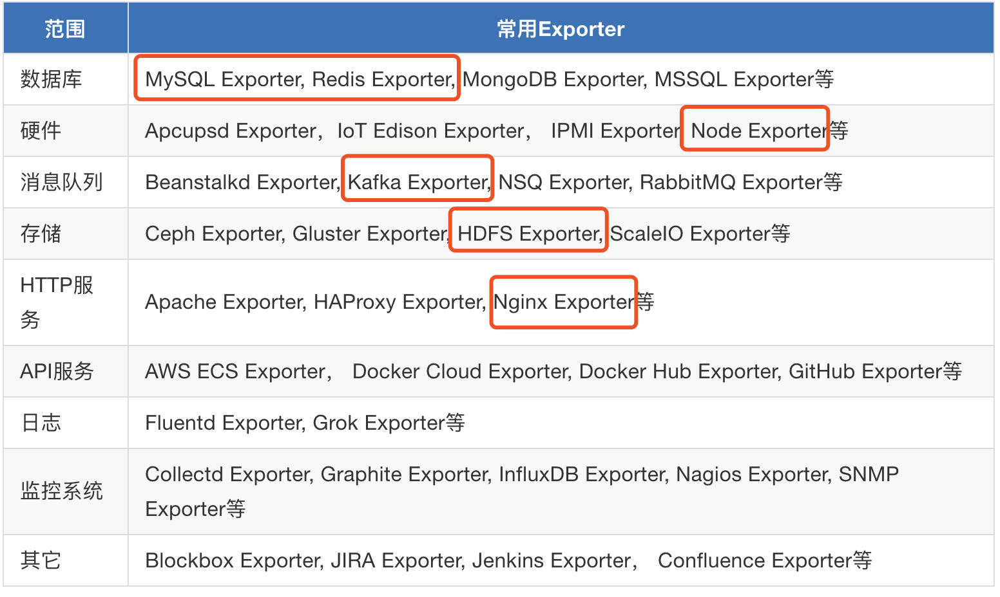

# 基于 prometheus 的监控系统
google的监控系统

Prometheus是一套开源监控系统，使用Go语言开发，是Google BorgMon监控系统的类似实现。

Prometheus的基本原理是通过HTTP协议周期性抓取被监控组件的状态，任意组件只要提供对应的HTTP接口就可以接入监控，是比较适合Docker，Kubernetes等环境的监控系统之一。输出监控信息的HTTP接口被称作exporter。


## prometheus
核心，提供时序数据存储，promql查询语言和定期拉取数据服务，目前使用的版本是2.17.1。对应的端口是9090。
* 安装部署
```bash
# 安装
## 获取 prometheus
wget wget https://github.com/prometheus/prometheus/releases/download/v2.17.1/prometheus-2.17.1.linux-amd64.tar.gz
## 解压 prometheus
tar -xzvf prometheus-2.17.1.linux-amd64.tar.gz
## 将软件文件 prometheus 移动到 /usr/local/prometheus
mv prometheus-2.17.1.linux-amd64 /usr/local/prometheus

# 创建 prometheus 用户及组，并指定数据目录
groupadd prometheus
useradd -g prometheus -d /var/lib/prometheus -s /sbin/nologin prometheus
mkdir /var/lib/prometheus
chown -R prometheus:prometheus /var/lib/prometheus
chown -R prometheus:prometheus /usr/local/prometheus

# systemd 服务化
## 将 prometheus.service 置于 /usr/lib/systemd/system/或 /lib/systemd/system
mv prometheus.service /usr/lib/systemd/system/
## service生效
systemctl enable prometheus
systemctl start prometheus
```


## node_exporter
用于主机节点的系统信息搜集，目前使用的是1.0.0版本，对应的端口是 9100
* 安装部署
```bash
# 安装
## 获取node_exporter
wget https://github.com/prometheus/node_exporter/releases/download/v1.0.0-rc.0/node_exporter-1.0.0-rc.0.linux-amd64.tar.gz
## 解压 node_exporter
tar -xzvf node_exporter-1.0.0-rc.0.linux-amd64.tar.gz
## 将二进制文件 node_exporter 移动到 /usr/local/bin
mv node_exporter-1.0.0-rc.0.linux-amd64/node_exporter /usr/local/bin/

# systemd 服务化
## 将 node_exporter.service 置于 /usr/lib/systemd/system/或 /lib/systemd/system
mv node_exporter.service /usr/lib/systemd/system/
## service生效
systemctl enable node_exporter
systemctl start node_exporter

# 配置 prometheus 文件
```

* [配置及玩法](./node_exporter.md)

主要介绍 node_exporter 的相关配置，并且使用其进行常见的监控。

## 可选 exporter

### 进程监控 process_exporter
### 自定义监控  pushgateway
### 日志监控   mtail
### 容器监控 cAdvisor
### java程序 jmx_exporter


## alertmanager
报警管理模块
### 安装部署
* 安装
```bash
## 获取 alertmanager
wget https://github.com/prometheus/alertmanager/releases/download/v0.20.0/alertmanager-0.20.0.linux-amd64.tar.gz
## 解压 alertmanager
tar -xzvf alertmanager-0.20.0.linux-amd64.tar.gz
## 将软件文件 alertmanager 移动到 /usr/local/alertmanager
mv alertmanager-0.20.0.linux-amd64 /usr/local/alertmanager

# 在prometheus模块创建之后，应该存在 prometheus 用户及组
chown -R prometheus:prometheus /usr/local/alertmanager

# systemd 服务化
## 将 alertmanager.service 置于 /usr/lib/systemd/system/或 /lib/systemd/system 
### 注意alertmanager.service中多了WorkingDirectory，指定工作目录，因为alertmanager要创建data目录，不指定可能有权限异常
mv alertmanager.service /usr/lib/systemd/system/
## service生效
systemctl enable alertmanager
systemctl start alertmanager
```

### 配置receiver

配置 alertmanager.yml 的过程中可以使用 amtool 来校验 yml
文件是否正确。
```bash
amtool check-config alertmanager.yaml 
```

* 接入企业微信


* 接入钉钉
```bash

curl -l -H "Content-type: application/json" -X POST -d '{"msgtype": "markdown","markdown": {"title":"Prometheus业务报警","text": "#### 监控指标\n> 监控描述信息\n\n> ###### 告警时间 \n"},"at": {"isAtAll": false}}' https://oapi.dingtalk.com/robot/send?access_token=5db7b7325727e4722588e96a5d2e09b12d53a71dac76ef8c956df91d59210e2d

```


### 与 prometheus 协同

* 在 /usr/local/prometheus/rules 目录下添加hoststats_alert.rules 规则样例文件
```yml
groups:
- name: hostStatsAlert
  rules:
  - alert: hostCpuUsageAlert
    expr: sum(avg without (cpu)(irate(node_cpu_seconds_total{mode!='idle'}[5m]))) by (instance) > 0.40
    for: 1m
    labels:
      severity: page
    annotations:
      summary: "Instance {{ $labels.instance }} CPU usgae high"
      description: "{{ $labels.instance }} CPU usage above 85% (current value: {{ $value }})"
  - alert: hostMemUsageAlert
    expr: (node_memory_total_bytes-node_memory_active_bytes)/node_memory_total_bytes > 0.85
    for: 1m
    labels:
      severity: page
    annotations:
      summary: "Instance {{ $labels.instance }} MEM usgae high"
      description: "{{ $labels.instance }} MEM usage above 85% (current value: {{ $value }})"
```

* 重启 prometheus
```bash
systemctl restart alertmanager
systemctl status alertmanager
```

### 测试生效
```bash
# 在监控的机器上执行该命令来提高cpu
cat /dev/zero>/dev/null
```


## grafana
界面管理，这里使用docker启服务
```bash
docker run -d --name=grafana -v $PWD/grafana.ini:/etc/grafana/grafana.ini -p 13000:13000 grafana/grafana
```

grafana有专门适配prometheus的数据源，配置url为 http://172.19.164.215:9090， 也有专业的针对 node_exporter的 dashboard 8919。


